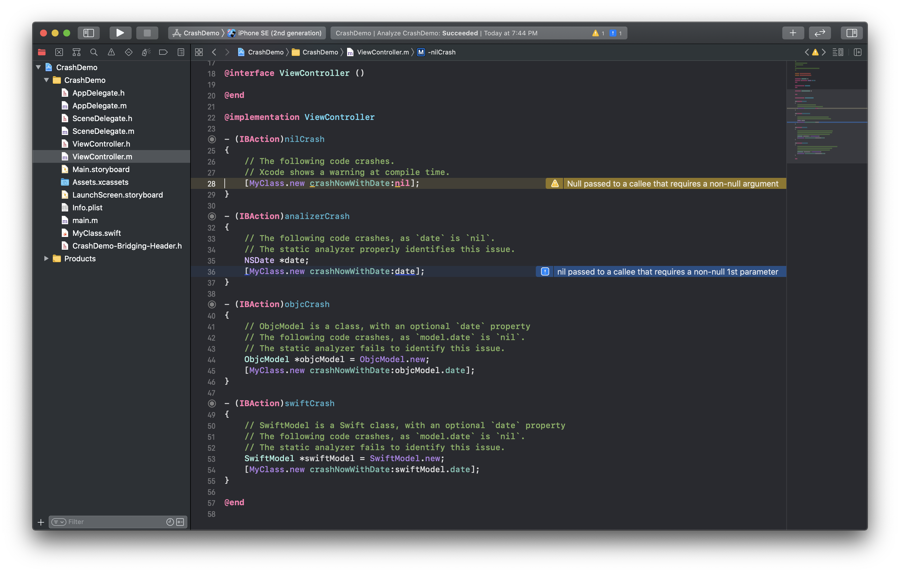

# Obj-c -> Swift Interoperability Crash



This is a demo project to showcase a simple, but problematic issue that leads to
runtime crashes on iOS, macOS, tvOS, and (presumably) watchOS apps.

Given this Swift code, with a method that takes non-optional parameters:

```swift
@objc
class MyClass: NSObject {
    @objc
    func crashNow(date: Date) {
        print("Crashing on \(date)")
    }
}
```

When calling this method from Obj-c, we will get a runtime error (crash) if
the date passed in is `nil`.

Unfortunally, as demostrated by this sample project, there is no way to configure
Xcode or the compiler to warn us of this issue.

## Examples

### Passing literal `nil`

In this case, Xcode will raise a warning

```objc
// The following code crashes.
// Xcode shows a warning at compile time.
[MyClass.new crashNowWithDate:nil]; // Warning: Null passed to a callee that requires a non-null argument
```
### Passing a local `nil` reference

In this case, Xcode will not raise a warning, but the static analyzer can be used to
identify this issue.

```objc
// The following code crashes, as `date` is `nil`.
// The static analyzer properly identifies this issue.
NSDate *date;
[MyClass.new crashNowWithDate:date]; // Analyzer issue: nil passed to a callee that requires a non-null 1st parameter
```

### Passing a `nil` reference from another object

In this case, Xcode will not raise a warning. The static analyzer will also fail to
identify the issue.

Runtime error with an Obj-c model:

```objc
@interface ObjcModel ()
@property (nonatomic) NSDate *date;
@end

@implementation ObjcModel
@end
```

```objc
// ObjcModel is a class, with an optional `date` property
// The following code crashes, as `model.date` is `nil`.
// The static analyzer fails to identify this issue.
ObjcModel *objcModel = ObjcModel.new;
[MyClass.new crashNowWithDate:objcModel.date];
```

Same runtime error with a Swift model:

```swift
@objc
class SwiftModel: NSObject {
    @objc var date: Date?
}
```

```objc
// SwiftModel is a Swift class, with an optional `date` property
// The following code crashes, as `model.date` is `nil`.
// The static analyzer fails to identify this issue.
SwiftModel *swiftModel = SwiftModel.new;
[MyClass.new crashNowWithDate:swiftModel.date];
```

## Nullability Annotations

Unfortunately, [nullability annotations](https://developer.apple.com/documentation/swift/objective-c_and_c_code_customization/designating_nullability_in_objective-c_apis)
seem to help only for calling Obj-c from Swift.
There seems to be no way to indicate the compiler a non-null value is required here.

## Xcode Runtime Sanitizers

It does not seem that any of Xcode runtime sanitizers helps identifying this issue either.

## Workaround

The only effective workaround is to not use non-optional parmeters on methods
tagged with `@objc`, as follows:

```swift
@objc
class MyClass: NSObject {
    @objc
    func crashNow(date: Date?) {
        guard let date = date else {
            // Handle `nil` case
        }
        // Safe to use `date`!
    }
}
```
